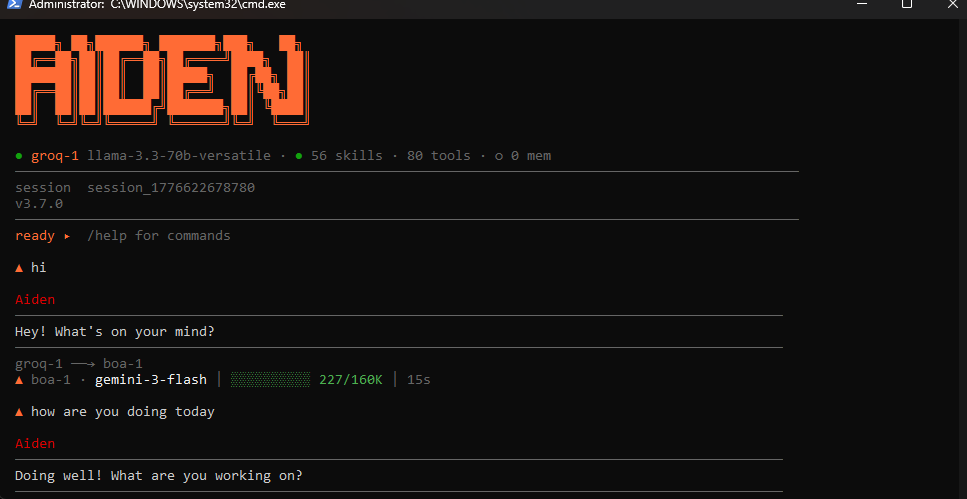
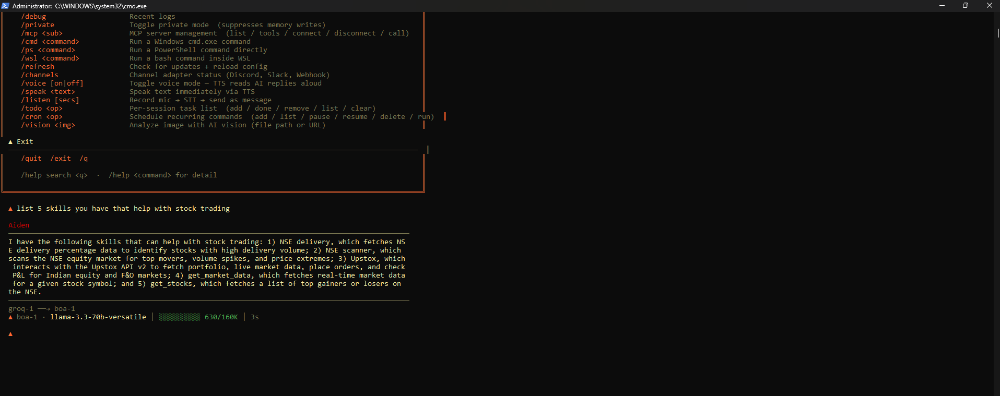
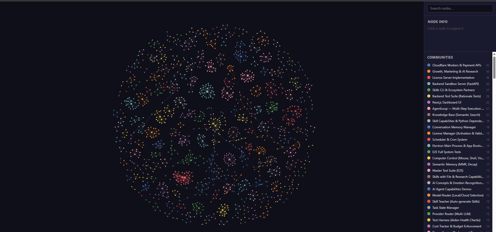

```
 █████╗ ██╗██████╗ ███████╗███╗   ██╗
██╔══██╗██║██╔══██╗██╔════╝████╗  ██║
███████║██║██║  ██║█████╗  ██╔██╗ ██║
██╔══██║██║██║  ██║██╔══╝  ██║╚██╗██║
██║  ██║██║██████╔╝███████╗██║ ╚████║
╚═╝  ╚═╝╚═╝╚═════╝ ╚══════╝╚═╝  ╚═══╝

local-first AI operating system
69+ skills · 80+ tools · 14+ providers · AGPL-3.0
Windows · Linux · WSL · macOS (API mode)
```

<p align="center">
  <a href="https://github.com/taracodlabs/aiden-releases/releases/latest"></a>
  <a href="https://github.com/taracodlabs/aiden-releases/releases"></a>
  <a href="https://discord.gg/gMZ3hUnQTm"></a>
  <a href="./LICENSE"></a>
  <a href="https://github.com/taracodlabs/aiden/stargazers"></a>
</p>

<p align="center">
  <a href="https://aiden.taracod.com"><b>Website</b></a> &nbsp;·&nbsp;
  <a href="https://aiden.taracod.com/contact"><b>Contact</b></a> &nbsp;·&nbsp;
  <a href="https://discord.gg/gMZ3hUnQTm"><b>Discord</b></a> &nbsp;·&nbsp;
  <a href="https://github.com/taracodlabs/aiden-releases/releases/latest"><b>Download</b></a>
</p>

---

> **v3.11 — Custom provider routing + Claude Haiku 4.5**
> Full custom OpenAI-compatible provider support: plug in any endpoint via config with no code changes. BayOfAssets Claude Haiku 4.5 ships as the new default tier-1 provider. Fixes silent Groq fallback in `callLLM`, greeting memory double-label, and health endpoint missing custom providers. See [changelog](#changelog) below.

---

Aiden is a local-first AI operating system. It runs entirely on
your machine — no cloud account required, no telemetry, no data leaving your
hardware unless you configure a cloud provider. It ships with a signed Windows
installer, and runs in headless API mode on Linux, WSL, and macOS. Features:
69+ composable skills, 80+ autonomous tools, a 6-layer memory architecture,
self-healing provider routing, and the ability to control your screen, browse
the web, run code, send emails, manage files, and hold a full conversation —
offline via Ollama.

## Platform support

| Platform | GUI app | API + CLI | Skills available |
|---|---|---|---|
| **Windows 10/11** | ✅ signed installer | ✅ | All 56 (including Windows-only skills) |
| **Linux** | — | ✅ headless | ~47 (Windows-only skills auto-skipped) |
| **WSL 2** | — | ✅ headless | ~47 (Windows-only skills auto-skipped) |
| **macOS** | — | ✅ headless | ~47 (Windows-only skills auto-skipped) |

Windows-only skills (clipboard history, Defender, OneNote, Outlook COM, registry, etc.) are tagged `platform: windows` and are silently skipped on other platforms at load time.

## Install

### Windows

```powershell
irm aiden.taracod.com/install.ps1 | iex
```

Or [download the installer](https://github.com/taracodlabs/aiden-releases/releases/latest) manually. Windows 10/11, 64-bit, ~500 MB disk space.

### Linux / WSL / macOS

```bash
curl -fsSL aiden.taracod.com/install.sh | bash
```

Or install manually:

```bash
# Prerequisites: Node.js 20+, git, Ollama (recommended)
git clone https://github.com/taracodlabs/aiden.git
cd aiden
cp .env.example .env          # configure OLLAMA_HOST, API keys, etc.
npm install
npm run build
npm start                     # starts the API server (headless)
# In a second terminal:
npm run cli                   # interactive TUI
```

Set `AIDEN_HEADLESS=true` to suppress the Electron GUI when running the packaged app.

## Screenshots

### Terminal (TUI)



Full command palette, 56 skills, 80 tools, automatic provider routing (Groq → BOA → Ollama). Runs in any terminal.

### Desktop app



Full chat interface with live activity panel. Local-first, connects to Ollama or any of 13 cloud providers via your own API key.

### Memory graph



6-layer memory visualized — every conversation, task, and learned pattern becomes a node in the knowledge graph. Fully local, persisted to disk, searchable.

---

## Features

| Category | What Aiden does |
|---|---|
| **Inference & providers** | Local Ollama (Llama 3, Mistral, Qwen, Gemma, Phi…) with optional cloud fallback to OpenAI, Anthropic, Groq, Cerebras, NVIDIA NIM, OpenRouter, and more — 14+ providers including custom OpenAI-compatible endpoints |
| **60+ tools** | Web search, file read/write, shell execution, Playwright browser automation, screen capture & OCR, calendar, email (IMAP/SMTP), code execution sandbox, clipboard, system info |
| **56 skills** | Composable plugins each with a `SKILL.md` prompt, tool implementations, and optional sandbox runner — install per-session or globally |
| **Subagent swarm** | Spawn N parallel agents on any task; vote, merge, or pick the best result automatically |
| **6-layer memory** | Episodic (in-context), BM25 keyword, vector semantic, procedural (skill), goal tracking, and `LESSONS.md` permanent-failure moat that grows every session |
| **Voice** | Speech-to-text (Groq → OpenAI → local Whisper.cpp) + text-to-speech (Edge TTS → ElevenLabs → Windows SAPI); full offline voice loop |
| **Channel adapters** | Discord, Slack, Telegram, WhatsApp, Email, Webhook, Twilio — any channel triggers the same agent loop |
| **Computer use** | Screenshots, screen state reader, GUI automation via keyboard/mouse when asked — full OS control mode |

---

## Architecture

```
User input (any channel)
        │
        ▼
  ┌─────────────┐
  │  Planner    │  ← breaks task into steps
  └──────┬──────┘
         │
         ▼
  ┌─────────────┐     ┌──────────────────┐
  │  Agent loop │────▶│  Tool dispatcher │──▶ 60+ tools
  │  agentLoop  │     └──────────────────┘
  └──────┬──────┘
         │
         ▼
  ┌─────────────────────────────────┐
  │  Memory (6 layers)              │
  │  episodic · BM25 · vector ·     │
  │  procedural · goal · LESSONS.md │
  └─────────────────────────────────┘
         │
         ▼
  ┌─────────────┐
  │  Provider   │  ← self-healing chain, 13 providers
  │  router     │
  └─────────────┘
         │
         ▼
     Response (streamed to originating channel)
```

See [ARCHITECTURE.md](ARCHITECTURE.md) for a full layer-by-layer breakdown, data flow diagrams, and the skill system design.

---

## Configuration

Copy `.env.example` to `.env` in the Aiden data directory.

```bash
cp .env.example .env
```

Key environment variables:

| Variable | Default | Notes |
|---|---|---|
| `OLLAMA_HOST` | `http://127.0.0.1:11434` | Override if Ollama runs on a different host/port |
| `OLLAMA_MODEL` | `mistral-nemo:12b` | Default chat model |
| `ANTHROPIC_API_KEY` | — | Optional cloud fallback |
| `OPENAI_API_KEY` | — | Optional cloud fallback |
| `GROQ_API_KEY` | — | Free tier: fast Llama 3 inference |
| `DAILY_BUDGET_USD` | `5.00` | Hard cap on daily cloud API spend |

See `.env.example` for the full list of ~90 variables covering voice, messaging integrations, search, computer use, and more.

---

## Contributing

Contributions are welcome — see [CONTRIBUTING.md](CONTRIBUTING.md) for the full guide.

- Bug fixes and new skills are the easiest entry points
- All contributors sign the [CLA](.github/CLA.md) once via PR comment
- Follow [Conventional Commits](https://www.conventionalcommits.org/)
- Run `npx tsc --noEmit` before opening a PR

---

## Resources

| | |
|---|---|
| **Download installer** | [Latest release](https://github.com/taracodlabs/aiden-releases/releases/latest) |
| **Releases & changelog** | [github.com/taracodlabs/aiden-releases](https://github.com/taracodlabs/aiden-releases) |
| **License** | AGPL-3.0 core · Apache-2.0 skills |

---

## Changelog

### v3.11.0 — 2026-04-25

**Custom provider routing**
- Full support for custom OpenAI-compatible endpoints via `customProviders` in `devos.config.json` — add any endpoint with a `baseUrl`, `apiKey`, and `model`; no code changes required
- Fixed silent Groq fallback bug in `callLLM`: custom providers now correctly route to their configured `baseUrl` instead of falling back to the Groq URL
- Fixed `raceProviders` pin-first logic: `primaryProvider` is now resolved from `customProviders` list when not found in `providers.apis`
- Fixed health/status endpoint (`/api/providers`) to include custom providers in the returned list, tier-sorted

**BayOfAssets Claude Haiku 4.5 as default primary**
- Swapped default primary provider to BayOfAssets Claude Haiku 4.5 (`claude-haiku-4-5`) at tier 1
- Groq and Gemini remain as tier-2 fallback chain

**Memory & greeting**
- Fixed `buildGreetingPreamble` double-label bug: `"Active goals: Active goals:\n..."` → compact single-line goal titles
- Added empty-string guard on greeting reply: blank preamble no longer produces `"Currently tracking: . What do you need?"`

---

### v3.10.0 — 2026-04-09

See [releases page](https://github.com/taracodlabs/aiden-releases/releases) for older changelogs.

---

## License

| Component | License |
|---|---|
| Core (`src/`, `cli/`, `api/`, `core/`, `providers/`, `dashboard-next/`) | [AGPL-3.0-only](LICENSE) |
| Skills (`skills/`) | [Apache-2.0](LICENSE-SKILLS.md) |

## Commercial use

Aiden's core is **AGPL-3.0**. You can self-host, modify, and study it freely. Embedding it in a commercial product or offering it as a hosted service requires either releasing your modifications under AGPL-3.0 or purchasing a commercial license.

Skills in `skills/` are **Apache-2.0** and can be used in commercial products without copyleft obligations.

For commercial licensing and enterprise deployments: **[aiden.taracod.com/contact?type=enterprise](https://aiden.taracod.com/contact?type=enterprise)**

---

Built by [Taracod](https://taracod.com) · Made in India · AGPL-3.0
